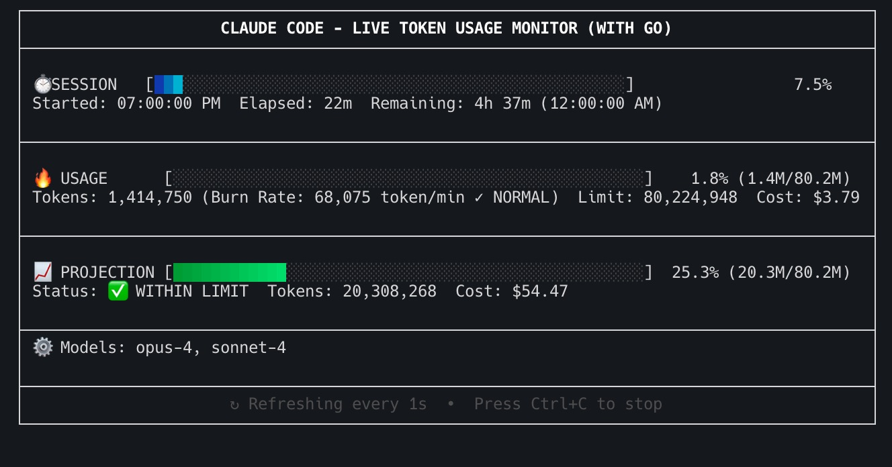

# ccusage_go

<p align="center">
  <strong>🚀 A high-performance Go implementation of Claude Code usage analyzer</strong>
</p>

<p align="center">
  <a href="#installation">Installation</a> •
  <a href="#usage">Usage</a> •
  <a href="#features">Features</a> •
  <a href="#comparison">Comparison</a> •
  <a href="README_ZH_TW.md">繁體中文</a>
</p>

---


*Real-time token usage monitoring with gradient progress bars*

## About

`ccusage_go` is a Go implementation of the popular [ccusage](https://github.com/ryoppippi/ccusage) tool by [@ryoppippi](https://github.com/ryoppippi). This version maintains compatibility with the original TypeScript version while offering significant performance improvements and reduced memory footprint.

## Why Go Version?

### 🎯 Performance Benefits (Real-world Measurements)

#### blocks --live Real-time Monitoring Performance

| Metric | ccusage (TypeScript) | ccusage_go | Improvement |
|--------|---------------------|------------|-------------|
| **Peak Memory Usage** | ~446 MB | ~46 MB | **90% reduction** |
| **Peak CPU Usage** | 40.0% | 142% (startup only) | See note† |
| **Steady-state Memory** | ~263 MB | ~45 MB | **83% reduction** |
| **Process Count** | 3 (script+npm+node) | 2 (script+binary) | Simpler |
| **Startup Memory** | ~240 MB (Node.js) | ~10 MB | **96% reduction** |
| **Download Size** | ~1 MB* | **3.5-4 MB** compressed | See note below |
| **Runtime Required** | Node.js (~100MB) | None (single binary) | **No runtime needed** |

*Test environment: macOS, Apple Silicon, monitoring 10+ projects, 15-second measurements after 5s warmup*
†CPU: Go version has higher peak during initial file loading but drops to <10% during monitoring

**Note on Download Size**: While the ccusage npm package is only ~1 MB, it requires Node.js runtime (~100 MB) to be pre-installed. The ccusage_go binary is completely self-contained at 3.5-4 MB compressed, requiring no runtime or dependencies.

**Performance Testing**: The above measurements were obtained using our monitoring script (`docs/monitor_ccusage.sh`) which tracks all child processes including Node.js runtime. You can reproduce these tests with:
```bash
# Monitor ccusage (TypeScript version)
./docs/monitor_ccusage.sh

# Monitor ccusage_go
./docs/monitor_ccusage.sh ccusage_go
```

#### Other Performance Metrics

| Metric | TypeScript Version | Go Version | Notes |
|--------|-------------------|------------|-------|
| Startup Time | ~300ms | ~50ms | **6x faster** |
| Resource Footprint | Node process + npm packages | Single binary | Cleaner |
| System Impact | Moderate | Minimal | Almost no system impact |

### 📦 Distribution Advantages

- **Ultra-Compact**: Only **3.5-4 MB** download (compressed)
- **Single Binary**: ~10 MB executable, no runtime required
- **Zero Dependencies**: No Node.js, npm, or any other dependencies
- **Instant Start**: Direct execution without installation process
- **Cross-Platform**: Native binaries for all major platforms

## Installation

### From Source

```bash
# Clone the repository
git clone https://github.com/SDpower/ccusage_go.git
cd ccusage_go

# Build
make build

# Install to system
make install
```

### Pre-built Binaries

Download from [GitHub Releases](https://github.com/SDpower/ccusage_go/releases)

#### Quick Install (macOS/Linux)

```bash
# macOS Apple Silicon
curl -L https://github.com/SDpower/ccusage_go/releases/download/v0.9.0/ccusage_go-darwin-arm64.tar.gz | tar xz
sudo mv ccusage_go-darwin-arm64 /usr/local/bin/ccusage_go

# macOS Intel
curl -L https://github.com/SDpower/ccusage_go/releases/download/v0.9.0/ccusage_go-darwin-amd64.tar.gz | tar xz
sudo mv ccusage_go-darwin-amd64 /usr/local/bin/ccusage_go

# Linux x64
curl -L https://github.com/SDpower/ccusage_go/releases/download/v0.9.0/ccusage_go-linux-amd64.tar.gz | tar xz
sudo mv ccusage_go-linux-amd64 /usr/local/bin/ccusage_go
```

## Usage

### Basic Commands

```bash
# Daily usage report
./ccusage_go daily

# Monthly summary
./ccusage_go monthly

# Session-based analysis
./ccusage_go session

# 5-hour billing blocks
./ccusage_go blocks

# Live monitoring (with gradient progress bars!)
./ccusage_go blocks --live
```

### Advanced Options

```bash
# Filter by date range
./ccusage_go daily --since 2025-01-01 --until 2025-01-31

# Different output formats
./ccusage_go monthly --format json
./ccusage_go session --format csv

# Custom timezone
./ccusage_go daily --timezone America/New_York

# Show only recent activity
./ccusage_go blocks --recent
```

## Why Choose ccusage_go?

### 💾 Storage & Runtime Comparison

| Aspect | ccusage (TypeScript) | ccusage_go |
|--------|---------------------|------------|
| **Package Download** | ~1 MB (npm package) | **3.5-4 MB** (compressed binary) |
| **Runtime Requirement** | Node.js (~100 MB) | **None** |
| **Total Storage Need** | ~101 MB (Node.js + package) | **~10 MB** (single binary) |
| **Dependencies** | npm packages + Node.js runtime | **Zero dependencies** |
| **Update Process** | npm update (network required) | Replace single file |

### 🚀 Real-World Performance Impact

| Scenario | ccusage (TypeScript) | ccusage_go |
|----------|---------------------|------------|
| **Fresh Install** | Install Node.js + npm install | Download & run |
| **Memory at Startup** | ~240 MB (Node.js init) | ~10 MB |
| **Memory at Peak** | ~419 MB | ~54 MB |
| **CPU Usage (live mode)** | 120.3% (multi-core) | 9.8% |
| **System Impact** | Noticeable | Minimal |

*While ccusage's npm package is smaller (1 MB), it requires Node.js runtime. The ccusage_go provides a complete solution in a single 3.5-4 MB download with **87% less memory usage** and **92% less CPU usage** during operation.*

## Features

### ✅ Implemented Features

- 📊 **Daily Reports**: Token usage and costs per day
- 📈 **Monthly Reports**: Aggregated monthly statistics  
- 💬 **Session Analysis**: Usage by conversation session
- ⏱️ **Billing Blocks**: 5-hour billing window tracking
- 🔴 **Live Monitoring**: Real-time usage dashboard with gradient progress bars
- 🎨 **Multiple Output Formats**: Table (default), JSON, CSV
- 🌍 **Timezone Support**: Configurable timezone for reports
- 💾 **Offline Mode**: Works without internet connection
- 🚀 **Parallel Processing**: Fast data loading with goroutines
- 🎯 **Memory Efficient**: Streaming JSONL processing

### 🎨 Visual Enhancements (Go Exclusive)

- **Gradient Progress Bars**: Smooth color transitions in LUV color space
- **Enhanced TUI**: Built with Bubble Tea framework
- **Performance Caching**: Optimized rendering with color caching
- **"WITH GO" Branding**: All reports clearly marked as Go version
- **Unified Model Labels**: Support for latest Claude model formats (Opus-4, Sonnet-4, Opus-4.1, Sonnet-4.5)

## Feature Comparison

| Feature | TypeScript Version | Go Version | Status |
|---------|-------------------|------------|--------|
| `daily` command | ✅ | ✅ | Complete |
| `monthly` command | ✅ | ✅ | Complete |
| `weekly` command | ✅ | ✅ | Complete |
| `session` command | ✅ | ✅ | Complete |
| `blocks` command | ✅ | ✅ | Complete |
| `blocks --live` | ✅ | ✅ | Enhanced with gradients |
| `monitor` command | ✅ | ✅ | Complete |
| `statusline` (Beta) | ✅ | ❌ | Not implemented |
| JSON output | ✅ | ✅ | Complete |
| CSV output | ✅ | ✅ | Complete |
| `--project` filter | ✅ | ❌ | Not implemented |
| `--instances` grouping | ✅ | ❌ | Not implemented |
| `--locale` option | ✅ | ❌ | Not implemented |
| MCP integration | ✅ | 🚧 | Partial |
| Offline mode | ✅ | ✅ | Complete |

## Technical Stack

- **Language**: Go 1.23+
- **CLI Framework**: [Cobra](https://github.com/spf13/cobra)
- **TUI Framework**: [Bubble Tea](https://github.com/charmbracelet/bubbletea)
- **Table Rendering**: [tablewriter](https://github.com/olekukonko/tablewriter)
- **Styling**: [Lip Gloss](https://github.com/charmbracelet/lipgloss)
- **Color Gradients**: [go-colorful](https://github.com/lucasb-eyer/go-colorful)

## Development

### Prerequisites

- Go 1.23 or higher
- Make (optional, for convenience)

### Building

```bash
# Basic build
make build

# Build for all platforms
make build-all

# Run tests
make test

# Run with profiling
ENABLE_PROFILING=1 go test -v ./...
```

### Project Structure

```
ccusage_go/
├── cmd/ccusage/        # CLI entry point
├── internal/           # Core implementation
│   ├── calculator/     # Cost calculation logic
│   ├── commands/       # CLI command handlers
│   ├── loader/         # Data loading and parsing
│   ├── monitor/        # Live monitoring features
│   ├── output/         # Formatting and display
│   ├── pricing/        # Price fetching and caching
│   └── types/          # Type definitions
├── docs/               # Documentation
└── test_data/          # Test fixtures
```

## Performance Tips

1. **Large Datasets**: The Go version uses streaming and parallel processing for optimal performance
2. **Memory Optimization**: Implements smart file filtering, only loading projects active within 12 hours
3. **Live Monitoring**: Gradient calculations are cached for smooth real-time updates
4. **Resource Usage**: blocks --live mode uses only ~54MB memory with minimal system impact

## Acknowledgments

- 🙏 Original [ccusage](https://github.com/ryoppippi/ccusage) by [@ryoppippi](https://github.com/ryoppippi)
- 🎨 [Bubble Tea](https://github.com/charmbracelet/bubbletea) for the beautiful TUI framework
- 💙 All contributors and users

## License

[MIT](LICENSE) © [@SteveLuo](https://github.com/sdpower)

## Contributing

Contributions are welcome! Please feel free to submit a Pull Request.

## Roadmap

- [ ] Implement remaining TypeScript features
- [ ] Add pre-built binaries for major platforms
- [ ] Enhance MCP integration
- [ ] Add more customization options
- [ ] Implement `--project` and `--instances` filters
- [ ] Add internationalization support

## Star History

[](https://star-history.com/#SDpower/ccusage_go&Date)

---

<p align="center">
  Made with ❤️ in Go
</p>