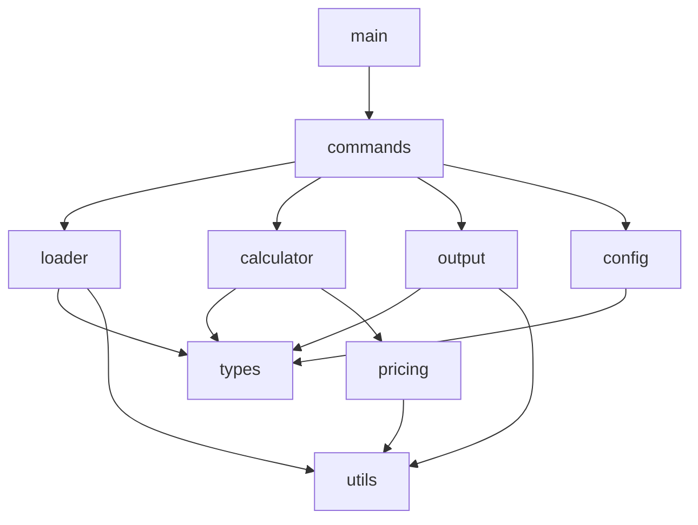

# ccusage Golang 整體架構設計

## 1. 專案概述

### 1.1 專案目標
將現有的 TypeScript/Node.js 版本的 ccusage CLI 工具完整轉換為 Golang 實作，保持功能完全相容，同時提升執行效能和降低資源消耗。

### 1.2 核心功能
- 分析 Claude Code 使用量數據
- 生成多種格式的使用報告（日報、月報、週報、會話、區塊）
- 成本計算與追蹤
- 即時使用監控
- JSON 輸出支援
- MCP (Model Context Protocol) 整合

### 1.3 設計原則
- **模組化設計**：每個功能模組獨立，低耦合高內聚
- **高效能**：充分利用 Go 的並行特性
- **可測試性**：每個模組都可獨立測試
- **向後相容**：保持與原版相同的 CLI 介面和輸出格式
- **易於維護**：清晰的程式碼結構和文檔

## 2. 系統架構

### 2.1 分層架構
```
┌─────────────────────────────────────────────────┐
│                  CLI Interface                   │
│                 (cobra/urfave)                   │
├─────────────────────────────────────────────────┤
│                Command Handlers                  │
│         (daily, monthly, session, etc.)          │
├─────────────────────────────────────────────────┤
│              Business Logic Layer                │
│      (Calculator, Aggregator, Analyzer)          │
├─────────────────────────────────────────────────┤
│                 Data Layer                       │
│         (Loader, Parser, Cache)                  │
├─────────────────────────────────────────────────┤
│              Infrastructure Layer                │
│         (File System, HTTP Client)               │
└─────────────────────────────────────────────────┘
```

### 2.2 模組架構圖
```
                    ┌──────────┐
                    │   main   │
                    └────┬─────┘
                         │
            ┌────────────┴────────────┐
            │                         │
      ┌─────▼─────┐           ┌──────▼──────┐
      │  Commands │           │   Config    │
      └─────┬─────┘           └─────────────┘
            │
     ┌──────┴──────────────────────┐
     │                              │
┌────▼────┐  ┌──────────┐  ┌──────▼──────┐
│ Loader  │  │Calculator│  │  Formatter  │
└─────┬───┘  └────┬─────┘  └──────┬──────┘
      │           │                │
      └───────────┴────────────────┘
                  │
           ┌──────▼──────┐
           │    Types    │
           └─────────────┘
```

## 3. 目錄結構設計

```
ccusage_go/
├── cmd/
│   └── ccusage/
│       └── main.go              # 程式進入點
├── internal/                    # 內部套件（不對外暴露）
│   ├── commands/                # 命令處理器
│   │   ├── daily.go
│   │   ├── monthly.go
│   │   ├── weekly.go
│   │   ├── session.go
│   │   ├── blocks.go
│   │   ├── statusline.go
│   │   ├── mcp.go
│   │   └── shared.go           # 共享命令配置
│   ├── loader/                  # 數據載入
│   │   ├── loader.go           # 主載入器
│   │   ├── parser.go           # JSONL 解析器
│   │   └── cache.go            # 載入快取
│   ├── calculator/              # 計算邏輯
│   │   ├── cost.go             # 成本計算
│   │   ├── tokens.go           # Token 計算
│   │   └── aggregator.go       # 數據聚合
│   ├── pricing/                 # 價格管理
│   │   ├── fetcher.go          # 價格獲取
│   │   ├── cache.go            # 價格快取
│   │   └── models.go           # 模型定價
│   ├── monitor/                 # 監控功能
│   │   ├── live.go             # 即時監控
│   │   └── tracker.go          # 使用追蹤
│   ├── output/                  # 輸出格式化
│   │   ├── table.go            # 表格輸出
│   │   ├── json.go             # JSON 輸出
│   │   ├── formatter.go        # 格式化器介面
│   │   └── responsive.go       # 響應式佈局
│   ├── types/                   # 類型定義
│   │   ├── usage.go            # 使用量類型
│   │   ├── session.go          # 會話類型
│   │   ├── models.go           # 模型類型
│   │   └── errors.go           # 錯誤類型
│   ├── utils/                   # 工具函數
│   │   ├── terminal.go         # 終端工具
│   │   ├── date.go             # 日期處理
│   │   ├── file.go             # 檔案操作
│   │   └── validation.go       # 驗證工具
│   └── config/                  # 配置管理
│       ├── config.go           # 配置載入
│       └── constants.go        # 常數定義
├── pkg/                         # 公開套件（可被外部使用）
│   └── ccusage/
│       ├── api.go              # 公開 API
│       └── types.go            # 公開類型
├── test/                        # 測試資源
│   ├── fixtures/               # 測試數據
│   └── integration/            # 整合測試
├── scripts/                     # 輔助腳本
│   ├── build.sh               # 建置腳本
│   └── test.sh                # 測試腳本
├── go.mod                      # Go 模組定義
├── go.sum                      # 依賴鎖定
├── Makefile                    # 建置自動化
└── README.md                   # 專案說明
```

## 4. 技術選型

### 4.1 核心框架
| 功能 | 技術選擇 | 理由 |
|------|---------|------|
| CLI 框架 | cobra | 功能完整、社群活躍、文檔豐富 |
| 配置管理 | viper | 與 cobra 整合良好、支援多種格式 |
| 日誌系統 | zap | 高效能、結構化日誌 |
| HTTP Client | 標準庫 net/http | 足夠滿足需求、無額外依賴 |

### 4.2 資料處理與介面
| 功能 | 技術選擇 | 理由 |
|------|---------|------|
| JSON 處理 | encoding/json + jsoniter | 標準庫為主、效能關鍵處使用 jsoniter |
| 終端 UI | bubbletea | 現代化 TUI 框架、豐富的組件支援 |
| 表格顯示 | bubbletea/bubbles/table | 與 bubbletea 整合、互動式表格 |
| 顏色輸出 | lipgloss | bubbletea 生態系統、樣式豐富 |
| 並行處理 | goroutines + sync | Go 原生並行機制 |

### 4.3 測試框架
| 功能 | 技術選擇 | 理由 |
|------|---------|------|
| 單元測試 | testing + testify | 標準庫 + 斷言增強 |
| Mock | gomock | Google 官方 Mock 框架 |
| 基準測試 | testing | 標準庫內建 |

## 5. 模組依賴關係



## 6. 核心設計決策

### 6.1 並行策略
- **檔案載入**：使用 worker pool 模式並行讀取多個 JSONL 檔案
- **數據處理**：pipeline 模式處理數據流
- **API 請求**：並行獲取價格資訊，實作重試機制

### 6.2 記憶體管理
- **物件池**：重用頻繁創建的物件減少 GC 壓力
- **串流處理**：大檔案使用串流讀取避免全部載入記憶體
- **延遲載入**：按需載入數據，避免不必要的記憶體佔用

### 6.3 錯誤處理
- **錯誤包裝**：使用 errors.Wrap 保留錯誤鏈
- **錯誤分類**：區分可恢復和不可恢復錯誤
- **優雅降級**：網路錯誤時自動切換離線模式

### 6.4 配置管理
- **環境變數**：支援 CLAUDE_CONFIG_DIR 等環境變數
- **預設值**：合理的預設配置
- **配置驗證**：啟動時驗證配置有效性

## 7. 介面設計

### 7.1 命令介面
```go
type Command interface {
    Execute(ctx context.Context, args []string) error
    Validate() error
    Help() string
}
```

### 7.2 載入器介面
```go
type Loader interface {
    Load(ctx context.Context, path string) ([]UsageEntry, error)
    LoadParallel(ctx context.Context, paths []string) ([]UsageEntry, error)
}
```

### 7.3 格式化器介面
```go
type Formatter interface {
    Format(data interface{}) (string, error)
    SetOptions(opts FormatterOptions) error
}
```

## 8. 效能目標

### 8.1 基準指標
- 載入 1GB JSONL 數據：< 2 秒
- 生成日報表：< 100ms
- 記憶體使用：< 100MB（一般使用場景）
- 並行處理：充分利用多核 CPU

### 8.2 優化重點
- 減少記憶體分配
- 使用 buffer pool
- 預編譯正則表達式
- 批次處理 I/O 操作

## 9. 相容性保證

### 9.1 CLI 相容
- 保持相同的命令結構
- 相同的參數名稱和短名稱
- 相同的輸出格式

### 9.2 數據相容
- 支援相同的 JSONL 格式
- 相同的日期時間處理
- 相同的成本計算邏輯

### 9.3 環境相容
- 支援相同的環境變數
- 相同的預設路徑
- 跨平台支援（Windows/Mac/Linux）

## 10. 擴展性考慮

### 10.1 插件系統
預留插件介面，支援：
- 自定義報表格式
- 額外的數據源
- 自定義成本計算

### 10.2 API 暴露
提供 pkg/ccusage 套件供其他 Go 程式使用：
```go
import "github.com/username/ccusage/pkg/ccusage"

analyzer := ccusage.NewAnalyzer()
report, err := analyzer.GenerateDailyReport(options)
```

## 11. 安全性考慮

### 11.1 資料安全
- 不記錄敏感資訊
- 本地數據處理，無需上傳
- 安全的檔案權限處理

### 11.2 依賴安全
- 最小化外部依賴
- 定期更新依賴版本
- 使用 Go modules 鎖定版本

## 12. 下一步

1. 完成其他設計文檔
2. 建立專案骨架
3. 實作核心模組
4. 編寫測試案例
5. 效能優化
6. 文檔完善